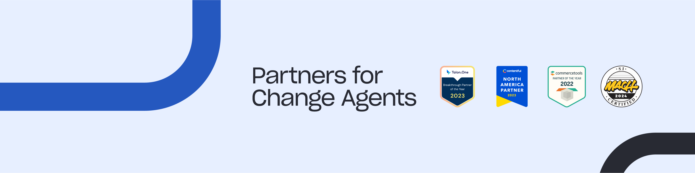

## 👋 Hello! 
Software engineer with 9+ years of experience.  Worked for innovative startups, large enterprise products, and award-winning agencies.  Familiar with both remote, and in-office roles.  Always seeking to take ownership of the project and deliver faster than expected.  Whether in positions of leadership or guiding frontend focused teams, I've spearheaded initiatives and shaped outcomes. Now, as an Engineering Manager in my present position, I guide teams to synchronize technical endeavors with organizational objectives, delivering meaningful outcomes.
